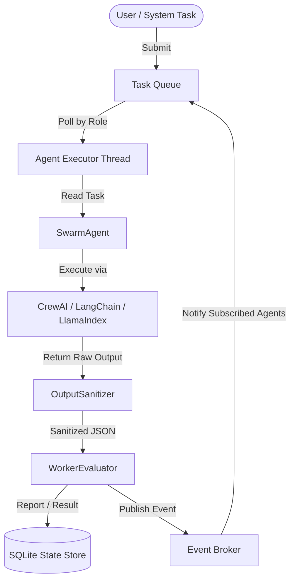

# Autonomous Agent Swarm Coordinator 🛠️

A thread-safe, event-driven framework for configuring, coordinating, and evaluating specialized worker agents. Integrates seamlessly with **CrewAI**, **LangChain**, and **LlamaIndex** to build reliable agentic workflows.

---

## Key Features

- 📢 **Event-Driven Communication**: A thread-safe, publish-subscribe `EventBroker` executing callbacks asynchronously via a thread pool.
- 🗂️ **Priority Routing Queue**: A thread-safe `TaskQueue` supporting priority ordering and role-specific dequeue filtering.
- 💾 **Thread-Safe State Persistence**: SQLite-backed `StateStore` keeping track of agent status, task logs, and evaluation reports safely under multi-threaded concurrency.
- 🧩 **Multi-Framework Support**: Modular agent wrappers wrapping CrewAI (`CrewAgentWrapper`), LangChain (`LangChainAgentWrapper`), and LlamaIndex (`LlamaIndexAgentWrapper`).
- 🧼 **Output Sanitization**: Dynamic parsing utility `OutputSanitizer` to extract JSON from raw LLM responses and validate fields using **Pydantic** models.
- 📊 **Worker Evaluation Pipeline**: Performance measurement (`WorkerEvaluator`) scoring agents on latency and Pydantic schema compliance, logging audit metrics directly.
- 🔗 **DAG-Based Workflow Coordination**: Coordinate complex dependencies (`WorkflowCoordinator`) with cycle detection and cascade cancellations.
- 🛑 **Human-in-the-Loop (HITL)**: Built-in `HITLGate` for pausing task execution until manual approval/rejection.
- 🛡️ **Crash Recovery Watchdog**: Background `SwarmWatchdog` daemon that detects dead agents and recovers their running tasks.

---

## Architectural Flow



---

## Schema Overview

### Agents Table
Stores active/inactive agent statuses.
- `agent_id` (Primary Key)
- `name`
- `role`
- `status` (`IDLE`, `BUSY`, `CRASHED`, `OFFLINE`)
- `last_active` (Timestamp)
- `last_heartbeat` (Timestamp)
- `assigned_task_id` (String, Optional)

### Tasks Table
Maintains absolute execution logs of all tasks.
- `task_id` (Primary Key)
- `name`
- `description`
- `worker_type`
- `priority` (Integer)
- `status` (`PENDING`, `PENDING_APPROVAL`, `RUNNING`, `COMPLETED`, `FAILED`, `CANCELLED`)
- `payload` (JSON)
- `result` (JSON, Optional)
- `error` (String, Optional)
- `correlation_id` (String)
- `max_retries` (Integer)
- `current_retry` (Integer)
- `parent_task_ids` (JSON Array)
- `workflow_id` (String, Optional)

### Evaluations Table
Logs audit metrics for agent performance auditing.
- `eval_id` (Primary Key)
- `task_id` (Foreign Key)
- `agent_id` (Foreign Key)
- `latency` (Float)
- `compliance` (Boolean)
- `score` (Float, 1.0 to 5.0)
- `metrics_payload` (JSON)

---

## Directory Structure

```
├── swarm/
│   ├── __init__.py
│   ├── core/
│   │   ├── __init__.py
│   │   ├── event.py          # Event schemas & types
│   │   ├── broker.py         # Thread-safe Pub/Sub broker
│   │   ├── queue.py          # Priority-based thread-safe task queue
│   │   ├── state.py          # SQLite persistence storage
│   │   ├── agent.py          # Base agent class & SDK wrappers
│   │   ├── workflow.py       # DAG-based workflow coordination
│   │   ├── hitl.py           # Human-in-the-loop approval gates
│   │   └── watchdog.py       # Background daemon for crash recovery
│   ├── utils/
│   │   ├── __init__.py
│   │   └── sanitizer.py      # JSON extraction & Pydantic validation
│   └── evaluation/
│       ├── __init__.py
│       └── evaluator.py      # Metrics tracker & latency analyzer
├── tests/
│   ├── __init__.py
│   ├── test_broker.py
│   ├── test_queue.py
│   ├── test_state.py
│   ├── test_sanitizer.py
│   ├── test_agent.py
│   ├── test_workflow.py
│   ├── test_hitl.py
│   └── test_watchdog.py
├── examples/
│   ├── __init__.py
│   └── demo_swarm.py         # Runnable example orchestration
├── requirements.txt
└── README.md
```

---

## Setup & Running Guide

### 1. Requirements

Make sure you have Python 3.10+ installed.

### 2. Environment Setup

Create a virtual environment and install requirements:
```bash
python3 -m venv .venv
source .venv/bin/activate
pip install --upgrade pip
pip install -r requirements.txt
```

### 3. Running Automated Tests

Run the full testing suite:
```bash
pytest tests/
```

### 4. Running the Demo Swarm Coordinator

Run the demo showing CrewAI and LangChain agents coordinating in a workflow (Research -> Summarize -> Evaluate) with mock LLMs (no API keys required):
```bash
python3 -m examples.demo_swarm
```
