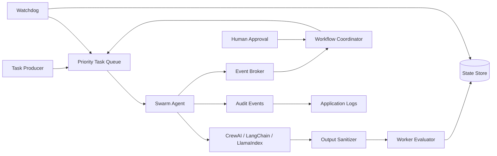

# Autonomous Agent Swarm

> Event-driven orchestration primitives for coordinating specialized AI workers with queues, DAG workflows, persistent state, evaluation, human approval, and crash recovery.

**Acadify Solution** maintains this repository as a reference implementation for building controlled, observable agentic systems.

[](requirements.txt)
[](tests/)
[](https://github.com/AcadifySolution/autonomous-agent-swarm/actions/workflows/codeql.yml)

## What is included

| Capability | Implementation |
| --- | --- |
| Agent runtime | Threaded worker lifecycle, heartbeats, bounded retries |
| Messaging | Thread-safe publish/subscribe event broker |
| Queueing | Priority queue with worker-role routing |
| State | SQLite-backed task, agent, and evaluation persistence |
| Workflows | DAG dependencies with cycle detection and cascade handling |
| Human control | Approval/rejection gates for gated tasks |
| Recovery | Watchdog detection and orphaned-task recovery |
| Output safety | JSON extraction and Pydantic validation |
| Evaluation | Latency and output/schema compliance metrics |
| Framework adapters | CrewAI, LangChain, and LlamaIndex wrappers |
| Guardrails | Retry, payload, task-size, priority, and workflow bounds |
| Auditability | Correlation-aware structured audit events |

## Architecture



## Runtime model

A task can move through the following lifecycle:

```text
PENDING
   |
   +-- approval required --> PENDING_APPROVAL --> PENDING
   |
   v
RUNNING
   +-- success -----------> COMPLETED
   +-- failure
        +-- retries remain -> PENDING
        +-- exhausted -----> FAILED
```

Workflow dependencies keep downstream tasks blocked until their required parents complete. A watchdog can recover tasks left in `RUNNING` when an agent stops sending heartbeats.

## Project structure

```text
swarm/
├── core/
│   ├── agent.py        # Worker lifecycle + framework wrappers
│   ├── broker.py       # Event pub/sub
│   ├── event.py        # Event contracts
│   ├── hitl.py         # Human approval gates
│   ├── limits.py       # Runtime guardrails
│   ├── audit.py        # Structured audit events
│   ├── queue.py        # Priority task queue
│   ├── state.py        # SQLite persistence
│   ├── watchdog.py     # Crash/recovery monitoring
│   └── workflow.py     # DAG orchestration
├── evaluation/
│   └── evaluator.py    # Execution quality metrics
└── utils/
    └── sanitizer.py    # LLM output parsing/validation

tests/                  # Regression and concurrency coverage
examples/               # Runnable demo
docs/                   # API and architecture documentation
RUNTIME_GUARDRAILS.md   # Runtime safety guidance
SECURITY.md             # Security baseline
CONTRIBUTING.md         # Development workflow
```

## Quick start

### Requirements

Python 3.10+ and a virtual environment.

### Install

```bash
python3 -m venv .venv
source .venv/bin/activate
python -m pip install --upgrade pip
pip install -r requirements.txt
```

### Run tests

```bash
pytest -q
```

### Run the demo

```bash
python -m examples.demo_swarm
```

The example uses mock-style execution paths and does not require production model credentials.

## Guardrails

Autonomous execution needs hard boundaries. The repository publishes explicit defaults in `swarm/core/limits.py`:

| Guardrail | Default |
| --- | ---: |
| Max retries | 5 |
| Max task description | 20,000 chars |
| Max serialized payload | 1 MB |
| Max workflow steps | 100 |
| Max priority | 100 |
| Recommended worker concurrency ceiling | 32 |

See [RUNTIME_GUARDRAILS.md](RUNTIME_GUARDRAILS.md).

These are library defaults, not a complete authorization system. Embedding applications should apply stricter limits based on task risk and business requirements.

## Safety model

The framework provides primitives for control, but callers remain responsible for policy enforcement.

Treat as untrusted input:

- model output
- tool output
- external events
- task payloads
- workflow-provided data

For high-impact actions, place an explicit authorization boundary and use a HITL gate before the side effect. Do not connect the swarm directly to destructive or irreversible tools without application-level authorization.

For deployment guidance, see [SECURITY.md](SECURITY.md).

## Evaluation

The included evaluator measures operational and output-level signals such as:

- execution latency
- output/schema compliance
- retry/failure behavior
- task-level evaluation records

For agentic systems, evaluate safety and reliability separately from task success. Recommended production signals include policy blocks, approval rate, retry rate, watchdog recoveries, tool failures, queue latency, and cost/token usage.

## Framework adapters

The core runtime is intentionally separated from external agent frameworks. Wrappers are provided for:

- CrewAI
- LangChain
- LlamaIndex

This keeps queueing, state, workflow coordination, evaluation, and recovery independent from the model/agent framework.

## Documentation

- [Architecture](docs/architecture.md)
- [API](docs/api.md)
- [Runtime Guardrails](RUNTIME_GUARDRAILS.md)
- [Security](SECURITY.md)
- [Contributing](CONTRIBUTING.md)

## Development quality gate

Every change should pass:

```bash
ruff check .
black --check .
pytest -q
```

GitHub Actions also runs Python compilation and CodeQL analysis.

## License

No license file is added by default. Without an explicit license, the repository remains subject to applicable copyright law.
