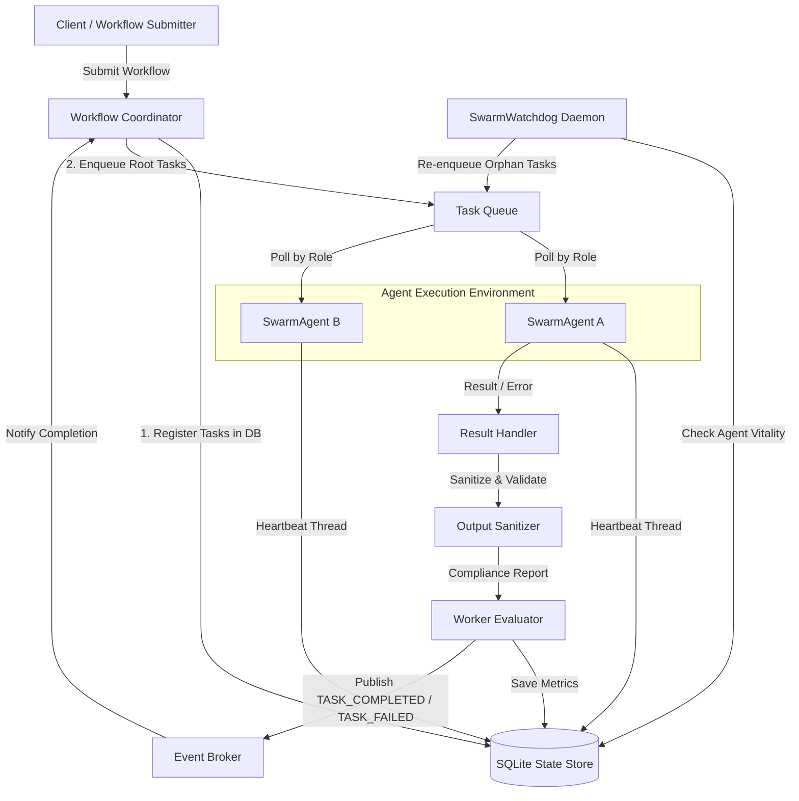

# System Architecture - Swarm Coordination Framework

This document outlines the detailed system architecture, concurrency models, and reliability mechanics of the agent swarm framework.

---

## 1. System Topology



---

## 2. Event-Driven Messaging Layer

### Event Broker (`EventBroker`)
- **Concurrency**: Guarded by a mutual exclusion lock (`threading.Lock`) over subscription maps.
- **Asynchronous Dispatch**: Executes callback routines on a background thread pool (`ThreadPoolExecutor`), isolating agent processes from blocking calling processes.
- **Audit Logging**: Every published event is subscribed to and logged to the immutable `swarm_events` table in SQLite, providing complete traceability and execution playback.

---

## 3. High-Reliability Scheduling Queue

### Task Queue (`TaskQueue`)
- **Ordering**: Min-heap structure sorted by:
  $$\text{Priority (Lower = Higher Priority)} \to \text{Timestamp (FIFO within Priority)}$$
- **Delayed Execution (`available_at`)**: Supports scheduling. If a task fails, it is enqueued with `available_at = time.time() + backoff_delay`. 
- **Block-and-Wait Mechanics**: Uses a condition variable (`threading.Condition(lock)`) to block worker threads when no active tasks match their designated `worker_type` filter. It calculates the sleep timeout exactly matching the next delayed task's availability delta to wake up automatically without polling.

---

## 4. Self-Healing Daemon (Watchdog)

### Swarm Watchdog (`SwarmWatchdog`)
- **Agent Registry**: Every active agent updates `agents.last_heartbeat` periodically (default: every 2 seconds).
- **Failure Identification**: The watchdog scans the table. If an agent fails to check in:
  $$t_{\text{current}} - t_{\text{last\_heartbeat}} > \text{Threshold (e.g., 10 seconds)}$$
  It marks the agent status as `CRASHED` and retrieves the assigned task.
- **Work Recovery**: The orphaned task status is reset to `PENDING` in the database and re-submitted to the priority queue, ensuring no lost executions.

---

## 5. Workflow DAG Resolution

### Directed Acyclic Graph Coordinator (`WorkflowCoordinator`)
- **Cycle Detection**: Executes depth-first search (DFS) with node visitation states to validate that submitted step dependency chains do not form loops.
- **Cascade Cancellation**: If a task fails permanently (exhausting its max retries), the coordinator triggers a recursive cascade, updating downstream tasks dependent on the failed branch to `CANCELLED` status.

---

## 6. Audit & Persistence Schema

The SQL schema maps three primary tables and an audit trail table:

```
                  +--------------------------------+
                  |             agents             |
                  +--------------------------------+
                  | agent_id (PK)                  |
                  | name, role, status             |
                  | last_active, last_heartbeat    |
                  | assigned_task_id               |
                  +--------------------------------+
                                  |
                                  | (tracks active)
                                  v
+------------------+     +------------------------+     +------------------------+
|   swarm_events   |     |         tasks          |     |      evaluations       |
+------------------+     +------------------------+     +------------------------+
| event_id (PK)    |     | task_id (PK)           |<----| eval_id (PK)           |
| event_type       |     | name, description, role|     | task_id (FK), agent_id |
| timestamp        |     | status, payload, result|     | latency, compliance    |
| sender_id        |     | error, correlation_id  |     | score, metrics         |
| payload          |     | max_retries, retry_no  |     | timestamp              |
| correlation_id   |     | parent_task_ids (JSON) |     +------------------------+
+------------------+     | workflow_id            |
                         +------------------------+
```
